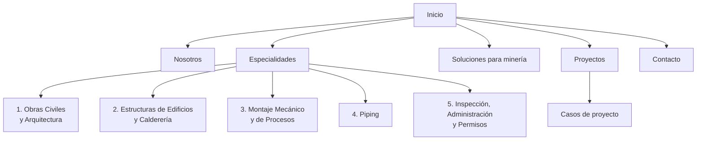

# S&M Ingeniería — Sitemap, copy y justificaciones

Sep 24, 2026 · @Seba

## Resumen

El sitio respeta las **5 especialidades del PPT tal como están**: cinco landings, una por especialidad, con su nombre oficial. La versión anterior agregaba una sexta ("Ingeniería de Proyectos EPC/EPCM"); en esta versión se elimina y ese contenido pasa a Nosotros e Inicio.

El copy tiene dos fuentes. La presentación _S&M final Resumido_ (PPT) define la empresa y las especialidades. El Excel _003 Listado de proyectos (CTTOS y OC) – WEB_ es la **fuente oficial de proyectos**: fechas, mandantes, alcances y cifras. Cuando ambas fuentes difieren en un proyecto, manda el Excel. Cada bloque de texto trae dos notas:

- **Fuente:** la lámina del PPT (L1, L2…) o el número de proyecto del Excel (N° 003, N° 136…) de donde sale la información.
- **Por qué:** la razón de la redacción, del cambio o de la exclusión.

Lo que no está en el PPT se marca como **\[VALIDAR\]** y se lista al final del documento. No hay cifras, certificaciones ni resultados inventados.

## Listado oficial de proyectos: qué cambió

El Excel registra **36 contratos y órdenes de compra** ejecutados entre octubre de 2019 y julio de 2026, para 7 mandantes. En la web se publican como **32 proyectos**, porque 3 proyectos tienen varias etapas contratadas por separado.

### Cómo se procesó el Excel

| Decisión                                                                  | Detalle                                                                                                                                                               | Por qué                                                                                        |
| ------------------------------------------------------------------------- | --------------------------------------------------------------------------------------------------------------------------------------------------------------------- | ---------------------------------------------------------------------------------------------- |
| Se fusionan etapas de un mismo proyecto                                   | N° 160 + 160.1 (líneas de emergencia) · N° 107.1 + 107.2 (filtro cerámico) · N° 003 + las 2 filas sin número (prefactibilidad y evaluación de recuperación de hierro) | Son fases de un solo trabajo; separarlas inflaría el portafolio y confundiría al lector        |
| No se publican números de OC ni de contrato                               | Ej.: "OC 2983", "CTTO 4600001591"                                                                                                                                     | Son datos comerciales de los mandantes; se usan solo como referencia interna en este documento |
| Se usa el nombre comercial de la faena, con el mandante legal en la ficha | "Minera Caserones" en el título; "SCM Minera Lumina Copper Chile" en la ficha                                                                                         | El comprador reconoce la faena; el nombre legal da precisión                                   |
| Se indica el cliente final cuando hay intermediario                       | "Minera Los Pelambres, vía Spin Technologies" · "CAP Minería, vía IP Industrial"                                                                                      | Es transparente y evita atribuirse una relación directa que no existe                          |
| Se reescriben los títulos del Excel                                       | Ej.: "Mobiliario, Campamento, Oficina, Ornamento" → "Instalaciones modulares tipo baño doble con rampa de acceso"                                                     | Varios títulos son nombres administrativos de la OC y no describen el trabajo                  |
| Las cifras del Excel reemplazan a las del PPT                             | Ver tabla siguiente                                                                                                                                                   | El Excel es la fuente oficial y tiene más detalle                                              |

### Diferencias con el PPT

| Proyecto                                | PPT                                | Excel (se usa en el sitio)                                                                                                                                            |
| --------------------------------------- | ---------------------------------- | --------------------------------------------------------------------------------------------------------------------------------------------------------------------- |
| Recuperación de hierro y agua (N° 003)  | EPCM, ejecutado oct 2021           | Prefactibilidad oct–nov 2020 · EPCM dic 2020 – oct 2021 · evaluación jun–jul 2021. El contrato es de **administración directa y asesoría técnica de la construcción** |
| Muro Guayacán (N° 136)                  | Cierre perimetral de 112 ml        | Cierre estructural de 111 m con planchas de zinc 5V; excavación de 65 m³; \~12 t de fierro y \~100 m³ de hormigón                                                     |
| Losa de acopio Cancha 0 (N° 012)        | Movimiento de tierras de 2.018 m²  | Losa de 2.034 m² con 424 m³ de hormigón y 36 t de fierro; relleno de 287 m³                                                                                           |
| Laboratorio metalúrgico (N° 095)        | 2 chancadores y 1 Gyroll; mar 2024 | 1 chancador de mandíbula y 2 Gyroll; generador de 44 kVA; dic 2023 – mar 2024                                                                                         |
| Galpón de reactivos (N° 086)            | Ejecutado feb 2024                 | dic 2023 – mar 2024; losa de 48 m² con canaleta antiderrames; galpón de 5 t                                                                                           |
| Inspección Caserones (N° 088)           | Lundin Mining, sin fecha           | SCM Minera Lumina Copper Chile; dic 2023 – ene 2024; inspección del **estado estructural y la corrosión**                                                             |
| Permisos Arqueros (N° 070)              | Sin fecha                          | may 2023 – abr 2025                                                                                                                                                   |
| Los Pelambres (N° 108)                  | Sin fecha                          | jul 2024 – mar 2025; 53,4 t de estructura y cubiertas                                                                                                                 |
| Filtros desaguadores Magnetita (N° 002) | Sin fecha                          | oct 2019 – ago 2020, vía IP Industrial; es el proyecto más antiguo del listado                                                                                        |

### Proyectos nuevos (no estaban en el PPT)

- **N° 135** · Ingeniería básica avanzada de filtrado de relaves, Los Pelambres (vía Spin), sep 2025 – ene 2026.
- **N° 153** · Ingeniería básica de optimización del sistema de filtrado, Planta Talcuna, desde oct 2025.
- **N° 170** · Servicios de ingeniería, obras hidráulicas y obras civiles menores, Minera San Gerónimo, abr – jul 2026.
- **N° 145** · Arriendo de retroexcavadora para limpieza de piscinas, Planta Delta, sep – oct 2025.

### Proyectos del PPT que no están en el listado oficial

Se retiran del portafolio hasta que S&M confirme si fueron contratados: recuperación de hierro desde acopios de baja ley (Planta Romeral – CAP, L29), planta de chancado con correa tripper (L27) y encapsulamiento de acopio con pantallas eólicas (L30). Las soluciones que ilustraban se mantienen en la página Soluciones, porque vienen de L3.

### Hallazgo sobre BMP Minerals

El Excel nombra el equipo "Filtro de Cerámicos **BMP** 21 m²" (N° 107.1). BMP Minerals parece ser **fabricante de equipos** (socio vendor), no mandante. Se propone moverlo de "Clientes" a "Socios estratégicos". **\[VALIDAR\]**

## Qué estaba enredado y cómo se corrigió

El sitemap anterior mezclaba tres cosas distintas bajo "Servicios". Esta tabla muestra cada problema y la corrección.

| Problema en la versión anterior                                                               | Por qué confundía                                                                                                                                                 | Corrección                                                                                                     |
| --------------------------------------------------------------------------------------------- | ----------------------------------------------------------------------------------------------------------------------------------------------------------------- | -------------------------------------------------------------------------------------------------------------- |
| Se agregó una 6ª landing: "Ingeniería de Proyectos EPC/EPCM"                                  | El PPT tiene 5 especialidades. EPC y EPCM son **modalidades de contrato**, no una especialidad. Además, la ingeniería ya está dentro de 4 de las 5 especialidades | Se elimina como landing. EPC/EPCM se explica en Nosotros ("Modalidades de contrato") y en un bloque del Inicio |
| Los nombres se acortaron en el menú y en las URLs sin explicar                                | El cliente no reconoce sus propias especialidades                                                                                                                 | El H1 de cada landing usa el nombre del PPT. El menú usa una versión corta, declarada en la sección de nombres |
| Las 5 especialidades se reagruparon en dos columnas ("Ingeniería" y "Construcción y Montaje") | Esa agrupación no existe en el PPT y separaba especialidades que son mixtas                                                                                       | El menú lista las 5 especialidades en el orden del PPT, sin agrupar                                            |
| La sección se llamaba "Servicios"                                                             | El PPT usa la palabra "Especialidades"                                                                                                                            | Se usa **Especialidades** en menú, URL y títulos                                                               |

**Lo que se mantiene y por qué:** la página _Soluciones para minería_ y la página _Proyectos_ se mantienen. Ambas salen directamente del PPT:

- **Soluciones** usa la lista de 11 tipos de proyecto de la lámina "Sobre nosotros".
- **Proyectos** replica las secciones 03 "Área Construcción" y 04 "Área Ingeniería e Inspección".

La página Soluciones no reemplaza a las especialidades. Es otra puerta de entrada: el cliente busca por **problema** ("recuperar agua de relaves") y desde ahí llega a la especialidad que lo resuelve.

## Sitemap final

El sitio tiene 7 páginas principales y 5 landings de especialidad, más los casos de proyecto.

El diagrama muestra la navegación; la tabla detalla URL, origen en el PPT y justificación de cada página.

| Página                                                   | URL                                                    | Origen en el PPT                                         | Por qué existe                                                                                  |
| -------------------------------------------------------- | ------------------------------------------------------ | -------------------------------------------------------- | ----------------------------------------------------------------------------------------------- |
| Inicio                                                   | `/`                                                    | Portada, lema, Sobre nosotros, Clientes                  | Resume la oferta y muestra prueba (clientes, proyectos) en los primeros segundos                |
| Nosotros                                                 | `/nosotros`                                            | Lámina 01 "Sobre nosotros", Clientes, Nos encontramos en | Los compradores B2B revisan quién está detrás antes de pedir cotización                         |
| Especialidades                                           | `/especialidades`                                      | Lámina 02 "Nuestras especialidades"                      | Índice de las 5 especialidades, con el mismo nombre de sección del PPT                          |
| 1. Obras Civiles y Arquitectura                          | `/especialidades/obras-civiles-y-arquitectura`         | Columna 1 de Especialidades + proyectos civiles          | Una landing por especialidad (requisito del proyecto)                                           |
| 2. Estructuras de Edificios y Calderería                 | `/especialidades/estructuras-y-caldereria`             | Columna 2 + Suministro Estructural Pelambres             | Idem                                                                                            |
| 3. Montaje de Equipos Mecánicos y de Procesos            | `/especialidades/montaje-mecanico-y-procesos`          | Columna 3 + montajes Talcuna                             | Idem                                                                                            |
| 4. Ingeniería, Fabricación y Montaje de Piping           | `/especialidades/piping`                               | Columna 4 + rediseños de líneas                          | Idem                                                                                            |
| 5. Inspección, Administración de Construcción y Permisos | `/especialidades/inspeccion-administracion-y-permisos` | Columna 5 + Caserones + Arqueros                         | Idem                                                                                            |
| Soluciones para minería                                  | `/soluciones-mineria`                                  | Lista de 11 proyectos tipo en "Sobre nosotros"           | Da entrada por problema; es como buscan los clientes en Google y en asistentes de IA            |
| Proyectos                                                | `/proyectos`                                           | Excel oficial de proyectos + secciones 03 y 04 del PPT   | Portafolio filtrable; es la principal prueba de experiencia                                     |
| Casos de proyecto                                        | `/proyectos/[slug]`                                    | Láminas de cada proyecto                                 | Páginas indexables por cliente y tipo de obra; se parte con 6 casos, uno por mandante principal |
| Contacto                                                 | `/contacto`                                            | Lámina Contacto                                          | Formulario de cotización con datos que califican al cliente                                     |
| Política de privacidad                                   | `/politica-de-privacidad`                              | No está en el PPT                                        | Obligatoria si el formulario recoge datos personales                                            |

**Menú principal:** Nosotros · Especialidades · Soluciones · Proyectos · Contacto · botón **Cotizar proyecto**.

**Sobre las URLs:** son cortas y sin artículos ("obras-civiles-y-arquitectura" en vez del nombre completo). Así son fáciles de leer, compartir y posicionar; el nombre completo va en el H1.

## Correspondencia PPT → sitio

Las 36 láminas del PPT se usan en el sitio; solo se descartan el índice, la portada repetida y los créditos de la plantilla. En el resto del documento, "L5" significa "lámina 5".

| Lámina | Contenido                                         | Dónde se usa en el sitio                                        |
| ------ | ------------------------------------------------- | --------------------------------------------------------------- |
| L1     | Portada, nombre y lema                            | Inicio (hero), footer                                           |
| L2     | Índice 01–04                                      | No se usa; la navegación del sitio cumple esa función           |
| L3     | Sobre nosotros + 11 tipos de proyecto             | Nosotros, Inicio, Soluciones                                    |
| L4     | Nuestras especialidades (5 columnas)              | Especialidades y sus 5 landings                                 |
| L5     | Correa molino N°3, Talcuna, abr 2026              | Proyectos · landings 2 y 3                                      |
| L6     | Muro de contención Guayacán, ENAMI                | Proyectos (caso destacado) · landing 1                          |
| L7     | Instalaciones modulares inclusivas, ENAMI         | Proyectos · landings 1 y 2                                      |
| L8     | Obras fluviales Cruz Grande, CMP                  | Proyectos · landing 1                                           |
| L9     | Filtro cerámico Talcuna 2024                      | Proyectos · landings 3 y 4                                      |
| L10    | Laboratorio metalúrgico, ENAMI                    | Proyectos · landings 1 y 3                                      |
| L11    | Galpón de reactivos, ENAMI                        | Proyectos · landings 1 y 2                                      |
| L12    | Losa de acopio, ENAMI                             | Proyectos · landing 1                                           |
| L13    | Piscina de emergencia + agua industrial, ENAMI    | Proyectos · landings 1 y 4                                      |
| L14    | Cubiertas + láminas HDPE, ENAMI                   | Proyectos · landing 1                                           |
| L15    | Mantención de piscinas, ENAMI                     | Proyectos · landing 1                                           |
| L16    | Stockpile Talcuna + agua potable Delta            | Proyectos · landings 1 y 4                                      |
| L17    | EPCM recuperación de hierro y agua, Talcuna       | Proyectos (caso destacado) · Inicio · Soluciones · landings 1–4 |
| L18    | Portada "Ingeniería, suministros e inspección"    | Título de la categoría Ingeniería en Proyectos                  |
| L19    | Agua de sello, Talcuna                            | Proyectos · landing 4                                           |
| L20    | Líneas de emergencia del filtrado, Talcuna        | Proyectos · landing 4                                           |
| L21    | Agua de procesos molienda, Talcuna                | Proyectos · landing 4                                           |
| L22    | Ingeniería de detalles filtrado de cobre, Talcuna | Proyectos · landings 2, 3 y 4                                   |
| L23    | Ingeniería Pelambres                              | Proyectos · landing 2                                           |
| L24    | Suministro estructural Pelambres                  | Proyectos · landing 2                                           |
| L25    | Inspección Caserones                              | Proyectos (caso destacado) · landing 5                          |
| L26    | Permisos Arqueros                                 | Proyectos (caso destacado) · landing 5                          |
| L27    | Planta de chancado con tripper, Talcuna           | Proyectos · landing 3 · Soluciones                              |
| L28    | Ingeniería inversa harnero, Talcuna               | Proyectos · landings 2 y 3                                      |
| L29    | Capacidad molienda Talcuna + Romeral CAP          | Proyectos · landing 3 · Soluciones                              |
| L30    | Espesador + encapsulamiento de acopio, Talcuna    | Proyectos · landings 2 y 3 · Soluciones                         |
| L31    | Factibilidad y detalles hierro y agua, Talcuna    | Caso EPCM (L17) · Soluciones                                    |
| L32    | Filtros desaguadores Magnetita, CAP               | Proyectos · landings 2 y 3                                      |
| L33    | Nuestros clientes                                 | Inicio, Nosotros, landings                                      |
| L34    | Nos encontramos en (portales)                     | Inicio, Nosotros, Contacto, footer                              |
| L35    | Contacto                                          | Contacto, footer                                                |
| L36    | Portada repetida y créditos Slidesgo              | No se usa                                                       |

**Nota tras el listado oficial:** las láminas L5 a L32 ya no son la fuente de datos de los proyectos; ahora se usan solo para fotos, pies de foto y ubicaciones. Los datos (fechas, cifras, mandantes) vienen del Excel. Las láminas L27, L30 (encapsulamiento) y L29 (Romeral) no tienen proyecto en el listado y sus proyectos se retiraron del portafolio.

## Nombres de las 5 especialidades

El nombre del PPT se conserva completo como H1 de cada landing. En el menú y las tarjetas se usa una versión corta. Solo hay dos correcciones gramaticales; ningún nombre cambia de sentido.

| #   | Nombre en el PPT (L4)                                                     | H1 de la landing                                                           | Nombre corto (menú y tarjetas)        | Por qué                                                                                                                                                                                                                               |
| --- | ------------------------------------------------------------------------- | -------------------------------------------------------------------------- | ------------------------------------- | ------------------------------------------------------------------------------------------------------------------------------------------------------------------------------------------------------------------------------------- |
| 1   | Ingeniería y Construcción de Obras Civiles y Arquitectura                 | Ingeniería y Construcción de Obras Civiles y Arquitectura                  | Obras Civiles y Arquitectura          | Sin cambios en el H1. El corto quita "Ingeniería y Construcción" porque ya es el nombre de la empresa y se repetiría en todo el menú                                                                                                  |
| 2   | Ingeniería, Fabricación y Montaje de Estructura de Edificios y Calderería | Ingeniería, Fabricación y Montaje de Estructuras de Edificios y Calderería | Estructuras y Calderería              | **Corrección:** "Estructura" pasa a plural, porque la especialidad abarca estructuras pesadas, medianas y livianas (L4). El corto quita "de Edificios" porque también incluye silos, tolvas, estanques y chutes, que no son edificios |
| 3   | Montaje de Equipos Mecánicos y de Procesos                                | Montaje de Equipos Mecánicos y de Procesos                                 | Montaje Mecánico y de Procesos        | Sin cambios en el H1. El corto solo condensa                                                                                                                                                                                          |
| 4   | Ingeniería, Fabricación y Montaje de Piping                               | Ingeniería, Fabricación y Montaje de Piping                                | Piping                                | Sin cambios en el H1. "Piping" es el término que usa el cliente minero y el más buscado                                                                                                                                               |
| 5   | Inspección, Administración de Construcción, Permisos                      | Inspección, Administración de Construcción y Permisos                      | Inspección, Administración y Permisos | **Corrección:** se reemplaza la última coma por "y", que es lo correcto al cerrar una enumeración en español                                                                                                                          |

**Regla para el diseño:** los nombres cortos nunca se usan como H1; ahí va siempre el nombre completo. En el título SEO se usa el nombre corto más la palabra clave, porque Google corta los títulos sobre 60 caracteres. Así el cliente reconoce su especialidad y el buscador muestra el título entero.

## Elementos globales

Estos elementos aparecen en todas las páginas.

### Header

- **Logo:** S&M Ingeniería y Construcción SpA
- **Menú:** Nosotros · Especialidades · Soluciones · Proyectos · Contacto
- **Botón:** Cotizar proyecto

_Fuente:_ L1 (nombre), L4 (Especialidades). _Por qué:_ el botón fijo de cotización es el estándar B2B 2026. El usuario puede convertir desde cualquier página sin volver al inicio.

### Submenú Especialidades

1. Obras Civiles y Arquitectura
2. Estructuras y Calderería
3. Montaje Mecánico y de Procesos
4. Piping
5. Inspección, Administración y Permisos

_Fuente:_ L4, en el mismo orden. _Por qué:_ se respeta el orden del PPT para que el cliente reconozca su estructura. No se agrupan las especialidades.

### Footer

- **Lema:** Construyendo futuro con eficiencia.
- **Texto:** Empresa de ingeniería y construcción nacida en la Región de Coquimbo, orientada a resolver problemáticas de la industria minera.
- **Columnas:** Especialidades (las 5) · Empresa (Nosotros, Soluciones, Proyectos) · Contacto
- **Contacto:** Balmaceda 1625, oficina 32, La Serena, Región de Coquimbo · +56 9 9542 0676 · contacto@sym-ingenieria.cl · Reuniones en La Serena, Calama y Santiago
- **Proveedor registrado:** Red Negocios CCS · SICEP · SAP Ariba · RyCE · Espacio Industrial Minero · ChileCompra Mercado Público · Wherex
- **Legal:** © 2026 S&M Ingeniería y Construcción SpA · Política de privacidad

_Fuente:_ L1 (lema), L3 (primer párrafo), L34 (portales), datos de contacto actualizados entregados por S&M (reemplazan a L35). _Por qué:_ los portales en el footer le ahorran al área de abastecimiento del cliente buscar si S&M está inscrita. Los teléfonos se escriben con espacios ("9542 0676") para que sean legibles en móvil. Las ciudades de reunión muestran cobertura en el norte minero y en Santiago, donde están las casas matrices de muchos mandantes.

### Botón flotante de WhatsApp

- **Texto:** Hablemos de su proyecto
- **Número:** +56 9 9542 0676 (enlace `https://wa.me/56995420676`)

_Por qué:_ en Chile, WhatsApp es el canal de primer contacto más usado, también en B2B. Se usa el teléfono oficial entregado por S&M. \[VALIDAR que el número tenga WhatsApp activo\]

## Copy: Inicio `/`

**Meta title:** S&M Ingeniería y Construcción | Proyectos mineros EPC y EPCM **Meta description:** Ingeniería, suministro, construcción y montaje para plantas mineras e industriales. Proyectos Greenfield y Brownfield desde La Serena.

### 1. Hero

- **Eyebrow:** Ingeniería y Construcción SpA · Construyendo futuro con eficiencia
- **H1:** Ingeniería y construcción para la minería, desde la idea conceptual hasta la puesta en marcha.
- **Bajada:** Desarrollamos proyectos Greenfield y Brownfield en modalidad EPC y EPCM para plantas mineras e industriales. Ingeniería de detalles, suministro de materiales, construcción y montaje con un solo equipo responsable.
- **Botones:** Cotizar un proyecto · Ver proyectos ejecutados

_Fuente:_ L1 (lema), L3 ("desde la Idea conceptual… hasta puesta en Marcha"; "Greenfield, Brownfield… EPC o EPCM"). _Por qué:_ el lema no va como H1 porque no dice qué hace la empresa ni para quién. El H1 responde en una línea qué hace (ingeniería y construcción), para quién (minería) y cuál es su diferencia (ciclo completo). El lema se conserva en el eyebrow y el footer.

### 2. Clientes

- **Texto:** Empresas que han confiado en nuestro trabajo
- **Logos:** Minera San Gerónimo · Los Pelambres – Antofagasta Minerals · Caserones – Lundin Mining · CAP Minería · Compañía Minera Arqueros · ENAMI · Spin Technologies

_Fuente:_ L33. _Por qué:_ en el PPT los clientes aparecen al final. En la web suben al segundo bloque, porque la prueba social debe verse antes de que el visitante haga scroll. BMP Minerals sale de esta barra: según el Excel es fabricante del filtro cerámico (N° 107.1) y pasa a Socios en Nosotros. \*\*\[VALIDAR\]\*\*

### 3. Cifras

| Cifra         | Texto                                                                   | Fuente                                 |
| ------------- | ----------------------------------------------------------------------- | -------------------------------------- |
| 32 proyectos  | de ingeniería, construcción, montaje, suministro, inspección y permisos | Excel: 36 contratos y OC, 32 proyectos |
| Desde 2019    | ejecutando proyectos para la minería                                    | Excel, N° 002 (oct 2019)               |
| +15 años      | de experiencia de nuestros profesionales                                | L3                                     |
| 6 disciplinas | civil, estructural, mecánica, piping, eléctrica e instrumentación       | L3                                     |

_Por qué:_ las cifras resumen la experiencia en segundos. "32 proyectos" y "desde 2019" salen del listado oficial; se usa "proyectos" y no "contratos" porque es lo que entiende el comprador. Los 15 años se atribuyen a **los profesionales**, como dice L3, y no chocan con "desde 2019", que es la trayectoria de la empresa. Se retiró "37 permisos" de las cifras: es un dato de un solo proyecto y queda mejor en su caso.

### 4. Propuesta de valor

- **H2:** Un solo equipo en todas las etapas de su proyecto
- **Texto:** S&M nace en la Región de Coquimbo para resolver problemáticas de la industria minera. Participamos desde la idea conceptual y la ingeniería de detalles hasta el suministro de materiales, la construcción, el montaje y la puesta en marcha. Incorporamos siempre la ingeniería _vendor_ de los equipos de nuestros socios estratégicos.

**Tres pilares:**

- **Ingeniería pensada para construirse.** Levantamiento en terreno, memorias de cálculo, modelos 3D para revisión de interferencias y listados de materiales listos para ejecutar.
- **Ejecución con control de calidad.** Procesos constructivos orientados a la norma ISO 9001, con un ciclo de planificación, ejecución, verificación y decisión que controla plazos, alcances y costos.
- **Experiencia en plantas en operación.** Proyectos Brownfield dentro de plantas activas de ENAMI, Minera San Gerónimo y CMP, entre otras.

_Fuente:_ L3 (origen, alcance, vendor, ISO 9001), L4 (levantamiento, memorias), L20 (esquema 3D, listado de materiales), L5–L16 (plantas en operación). _Por qué:_ se dice "orientados a la norma ISO 9001" y no "certificados", porque L3 no menciona certificación. Decir "certificados" sin serlo sería un riesgo legal y comercial.

### 5. Especialidades

- **H2:** Nuestras especialidades

| Tarjeta                               | Texto                                                                                           |
| ------------------------------------- | ----------------------------------------------------------------------------------------------- |
| Obras Civiles y Arquitectura          | Planimetría, fundaciones, losas, muros de contención, galpones y geomembranas.                  |
| Estructuras y Calderería              | Estructuras pesadas, medianas y livianas; silos, tolvas, estanques y chutes.                    |
| Montaje Mecánico y de Procesos        | Chancado, molienda, concentración, filtrado, espesamiento y transporte de minerales.            |
| Piping                                | Cañerías de acero, acero inoxidable, spools engomados, HDPE y canales engomados.                |
| Inspección, Administración y Permisos | Inspección en terreno, administración de construcción y permisos sectoriales, sanitarios e IFC. |

_Fuente:_ L4, una tarjeta por columna. _Por qué:_ cada texto resume las sub-listas de su columna en una línea, sin agregar servicios.

### 6. Soluciones (bloque puente)

- **H2:** Resolvemos problemas concretos de su planta
- **Texto:** Recuperar hierro desde relaves, filtrar relaves para su manejo en seco, recuperar agua de proceso, proteger acopios o ampliar la capacidad de una planta. Diseñamos y ejecutamos la solución completa.
- **Botón:** Ver soluciones para minería

_Fuente:_ L3, lista de proyectos tipo. _Por qué:_ conecta el problema del cliente con las especialidades.

### 7. Proyectos destacados

- **H2:** Proyectos que respaldan nuestra experiencia
- **Tarjetas:**
  - Recuperación de agua y minerales de hierro · EPCM · Planta Talcuna – Cía. Minera San Gerónimo · 2020–2021
  - Ingeniería básica avanzada de filtrado de relaves · Minera Los Pelambres · 2025–2026
  - Obras de arte N°4 y N°5 del camino de acceso a la dársena · Puerto Cruz Grande – CMP · 2024–2025
  - Sostenimiento de muro de contención y cierre estructural · Poder de Compra Guayacán – ENAMI · 2025–2026
- **Botón:** Ver todos los proyectos

_Fuente:_ Excel N° 003, 135, 117 y 136. _Por qué:_ se eligieron cuatro mandantes distintos y cuatro tipos de trabajo (EPCM, ingeniería, obra vial-fluvial y obra civil). Pelambres reemplaza a Caserones en el Inicio porque es más reciente (2025–2026) y cubre las seis disciplinas; Caserones y Arqueros siguen como casos en Proyectos.

### 8. Modalidades de contrato

- **H2:** Nos adaptamos a su forma de contratar
- **EPC:** Ingeniería, adquisiciones y construcción bajo un solo contrato y una sola responsabilidad.
- **EPCM:** Gestionamos ingeniería, adquisiciones y administración de la construcción en representación del mandante.
- **Greenfield:** Proyectos nuevos, desde cero.
- **Brownfield:** Ampliaciones y mejoras en plantas existentes.

_Fuente:_ L3 menciona las cuatro modalidades. _Por qué:_ aquí llega el contenido de la antigua 6ª landing. Las definiciones son las estándar de la industria y se agregan porque no todos los compradores (por ejemplo, abastecimiento) conocen los términos.

### 9. Proveedor registrado

- **H2:** Proveedor registrado en los principales portales de abastecimiento
- **Texto:** Estamos inscritos en Red Negocios CCS, SICEP, SAP Ariba, RyCE, Espacio Industrial Minero, ChileCompra Mercado Público y Wherex.

_Fuente:_ L34. _Por qué:_ la inscripción es requisito de compra en la gran minería; mostrarla quita una barrera al cliente.

### 10. CTA final

- **H2:** ¿Tiene un proyecto en evaluación?
- **Texto:** Cuéntenos el alcance, la faena y la etapa en que se encuentra. Nuestro equipo técnico revisará su requerimiento.
- **Botones:** Cotizar un proyecto · Descargar presentación corporativa (PDF)

_Fuente:_ L35 ("¡No dude en contactarnos!"). _Por qué:_ se pide información concreta (alcance, faena, etapa) para que el primer contacto sirva para cotizar. La descarga del PDF reutiliza el PPT como material para quien aún no está listo para cotizar.

## Copy: Nosotros `/nosotros`

**Meta title:** Nosotros | S&M Ingeniería y Construcción SpA, La Serena **Meta description:** Empresa de ingeniería y construcción de la Región de Coquimbo, con profesionales de más de 15 años de experiencia en proyectos mineros.

### 1. Hero

- **H1:** Ingeniería y construcción nacida en la Región de Coquimbo para la industria minera.
- **Bajada:** Cubrimos la necesidad de servicios profesionales de ingeniería y construcción de nuestros clientes.

_Fuente:_ L3, primer párrafo. _Por qué:_ el origen regional es un argumento de cercanía con las faenas del norte; por eso va en el H1.

### 2. Quiénes somos

- **H2:** Quiénes somos
- **Párrafo 1:** S&M Ingeniería y Construcción SpA nace en la Región de Coquimbo, orientada a resolver problemáticas de la industria minera y a cubrir la necesidad de servicios profesionales de ingeniería y construcción de nuestros clientes.
- **Párrafo 2:** Desarrollamos proyectos Greenfield, Brownfield e ingeniería de detalles en contratos de modalidad EPC o EPCM. Incluimos siempre la ingeniería _vendor_ en la provisión de equipos de nuestros socios estratégicos.
- **Párrafo 3:** Contamos con profesionales de más de 15 años de experiencia en proyectos multidisciplinarios, en niveles conceptuales, de diseño y de construcción.

_Fuente:_ L3, párrafos 1 a 3, casi textuales. _Por qué:_ es el texto institucional del cliente; solo se corrigió puntuación y concordancia. En la página de identidad conviene mantener su voz.

### 3. Disciplinas

- **H2:** Seis disciplinas, un solo equipo
- **Disciplinas:** Civiles · Estructurales · Mecánicas · Piping · Eléctricas · Instrumentación
- **Texto:** Integrar las disciplinas en un mismo equipo reduce interferencias, retrabajos y tiempos de coordinación entre la ingeniería y la obra.

_Fuente:_ L3 (lista de disciplinas). _Por qué:_ la frase del texto es un argumento de venta agregado; describe la consecuencia práctica de lo que dice L3, sin prometer cifras.

### 4. Cómo trabajamos

- **H2:** Planificación, ejecución y control
- **Texto:** Nuestros objetivos se basan en la planificación, la organización y la dirección de recursos humanos y materiales, junto con la ejecución y el control de los planes.
- **Subtítulo:** Ciclo de aseguramiento de calidad, orientado a la norma ISO 9001
  1. **Planificación:** definimos alcance, recursos, plazos y riesgos.
  2. **Ejecución:** construimos y montamos según la ingeniería aprobada.
  3. **Verificación:** controlamos calidad, avance y costos.
  4. **Decisión:** corregimos a tiempo para cumplir lo comprometido.
- **Cierre:** Este ciclo nos permite mantener y controlar tiempos, alcances y costos.

_Fuente:_ L3, párrafos 4 y 5. _Por qué:_ las cuatro etapas son las de L3; la frase de cada etapa explica qué significa en obra, para que el lector no técnico lo entienda.

### 5. Del concepto a la puesta en marcha

- **H2:** Participamos en todo el ciclo del proyecto
- **Etapas:** Idea conceptual → Ingeniería de detalles → Suministro de materiales → Construcción y montaje → Puesta en marcha

_Fuente:_ L3, columna derecha. _Por qué:_ es la frase más diferenciadora del PPT; como línea de tiempo se entiende en un vistazo.

### 6. Modalidades de contrato

Mismo bloque que en Inicio (EPC, EPCM, Greenfield, Brownfield). Se suma una línea:

- **Ingeniería de detalles:** desarrollamos la ingeniería para que su equipo o un tercero la ejecute.

_Fuente:_ L3 ("Ingeniería de detalles por contratos…"). _Por qué:_ aquí vive el contenido de la antigua landing EPC/EPCM.

### 7. Clientes

- **H2:** Nuestros clientes
- **Logos:** los 7 de L33, sin BMP Minerals
- **Texto:** Hemos ejecutado proyectos para compañías mineras estatales y privadas en las regiones de Coquimbo, Atacama y Antofagasta.

_Fuente:_ L33 (clientes); L5–L32 (ubicaciones: Talcuna, Delta, Pelambres, Romeral y Guayacán en Coquimbo; Vallenar, Copiapó, El Salado y Caserones en Atacama; Taltal en Antofagasta). _Por qué:_ las regiones no aparecen escritas en el PPT, pero se deducen de las plantas y dan contexto geográfico al comprador.

### 8. Trabajo colaborativo

- **H2:** Trabajo con socios estratégicos
- **Texto:** Trabajamos junto a socios de ingeniería y fabricantes de equipos. Con Spin Technologies – Ingeniería & Tecnología desarrollamos la ingeniería y el suministro estructural de plantas de filtrado para Minera Los Pelambres. Con equipos BMP montamos un filtro cerámico de 21 m² en Planta Talcuna, incorporando la ingeniería _vendor_ del fabricante.

**Trayectoria (nuevo bloque):**

- **H2:** Proyectos desde 2019
- **2019:** Ingeniería de filtros desaguadores para la Planta Magnetita de CAP Minería.
- **2020–2021:** Prefactibilidad y gestión EPCM de la planta de recuperación de agua y minerales de hierro en Planta Talcuna.
- **2022–2024:** 13 proyectos de construcción, montaje e ingeniería para ENAMI Planta Delta y Minera San Gerónimo; permisos para Minera Arqueros e inspección técnica en Minera Caserones.
- **2024–2026:** Ingeniería y suministro para Los Pelambres, obras de arte para CMP, muro de contención para ENAMI y rediseño de líneas de proceso en Planta Talcuna.

_Fuente:_ Excel N° 108, 135 (Spin), N° 107.1 (BMP), fechas de todo el listado; L3 (ingeniería vendor). _Por qué:_ el Excel confirma que en Pelambres S&M trabajó **para** Spin, que a su vez atendía a la minera; decirlo evita atribuirse una relación directa. La trayectoria muestra crecimiento sostenido con fechas reales. Los 13 proyectos de 2022–2024 son los que comienzan en esos años para ENAMI y San Gerónimo. **\[VALIDAR que Spin y BMP aprueban la mención\]**

### 9. Proveedor registrado

Mismo bloque que en Inicio. _Fuente:_ L34.

### 10. CTA

- **H2:** Conversemos sobre su próximo proyecto
- **Botón:** Contactar al equipo

## Copy: Especialidades `/especialidades`

**Meta title:** Especialidades en ingeniería, construcción y montaje minero | S&M **Meta description:** Obras civiles, estructuras y calderería, montaje mecánico, piping, inspección y permisos para plantas mineras e industriales.

### 1. Hero

- **H1:** Nuestras especialidades
- **Bajada:** Cinco especialidades que cubren un proyecto minero o industrial completo. Puede contratarnos para el proyecto integral o para una especialidad específica.

_Fuente:_ L4 (título "Nuestras especialidades"). _Por qué:_ se mantiene el título exacto del PPT. La bajada aclara que se puede contratar por partes, una duda habitual del comprador.

### 2. Tarjetas (una por especialidad, en el orden de L4)

Cada tarjeta lleva el **nombre completo** del PPT, tres líneas de alcance y el botón "Ver especialidad".

1. **Ingeniería y Construcción de Obras Civiles y Arquitectura**
   - Planimetría, especificaciones técnicas y memorias de cálculo
   - Fundaciones, losas, radieres, muros de contención y galpones
   - Impermeabilización con geomembranas HDPE y PVC
2. **Ingeniería, Fabricación y Montaje de Estructuras de Edificios y Calderería**
   - Estructura pesada: edificios de plantas y correas transportadoras
   - Estructura mediana: silos, tolvas, estanques y chutes
   - Estructura liviana: soportes, parrillas, guarderas, escaleras y barandas
3. **Montaje de Equipos Mecánicos y de Procesos**
   - Plantas de chancado, molienda, concentración, filtrado y espesamiento
   - Correas transportadoras, alimentadores y harneros
   - Bombas de pulpa y agua
4. **Ingeniería, Fabricación y Montaje de Piping**
   - Cañerías y fitting de acero y acero inoxidable
   - Spools de acero engomados y canales engomados
   - Tuberías de HDPE desde 32 mm
5. **Inspección, Administración de Construcción y Permisos**
   - Revisión de ingeniería e inspección en terreno
   - Gestión de compras, asesoría constructiva y cierre de proyectos
   - Permisos sectoriales, sanitarios e IFC

_Fuente:_ L4, sub-listas de cada columna. _Por qué:_ en esta página sí se usan los nombres completos, porque es el índice oficial y replica la lámina del cliente.

### 3. Bloque de orientación

- **H2:** ¿Aún no define el alcance?
- **Texto:** Podemos comenzar con una inspección técnica o una evaluación del proceso para definir la solución correcta antes de invertir.
- **Botón:** Solicitar evaluación técnica

_Fuente:_ L3 ("Detección, evaluación y propuesta de levantamiento de condiciones sub estándares"), L31 (análisis de factibilidad). _Por qué:_ captura al cliente que tiene un problema pero todavía no sabe qué especialidad necesita.

## Copy: Especialidad 1 · Obras Civiles y Arquitectura

**URL:** `/especialidades/obras-civiles-y-arquitectura` **Meta title:** Obras civiles para minería: fundaciones, losas y muros | S&M **Meta description:** Ingeniería y construcción de fundaciones, losas, muros de contención, galpones y geomembranas HDPE y PVC para faenas mineras.

Todas las landings siguen la misma estructura: hero, contexto, alcance, proyectos, por qué S&M, preguntas frecuentes y CTA. _Por qué:_ es el orden en que decide un comprador técnico: qué hacen, si lo han hecho antes y cómo contactarlos.

### 1. Hero

- **Eyebrow:** Especialidad 01
- **H1:** Ingeniería y Construcción de Obras Civiles y Arquitectura
- **Bajada:** Diseñamos y construimos la base de su instalación minera: fundaciones, losas, muros de contención, galpones e impermeabilizaciones, desde el levantamiento en terreno hasta la entrega.
- **Botón:** Cotizar obra civil

_Fuente:_ L4, columna 1. _Por qué:_ el H1 es el nombre exacto del PPT. La bajada enumera las obras de la columna para que el visitante confirme en segundos que está en la página correcta.

### 2. Contexto

- **H2:** La base de toda instalación minera
- **Texto:** Cada equipo, estructura o acopio depende de una obra civil bien calculada y bien ejecutada. Desarrollamos la planimetría y las especificaciones técnicas, y construimos con control en cada etapa: excavación, enfierradura, moldaje, hormigonado y terminaciones.

_Fuente:_ L4 (Planimetría, EETT); etapas tomadas de los pies de foto de L6, L10, L12 y L13. _Por qué:_ las etapas vienen de las fotos reales del PPT; muestran método sin inventar procesos.

### 3. Alcance

- **H2:** Qué incluye esta especialidad
- **Planimetría y EETT:** levantamiento en terreno, diseño e ingeniería, memorias de cálculo y documentos técnicos.
- **Obras civiles:** fundaciones de edificios y equipos; losas, radieres y muros de contención; galpones, oficinas, salas de cambio y baños.
- **Geomembranas:** impermeabilización con geotextil y lámina HDPE de 1 a 2 mm, e impermeabilización con PVC desde 0,75 mm.

_Fuente:_ L4, columna 1, completa y sin agregados. _Por qué:_ el alcance oficial se copia íntegro para que coincida con lo que S&M cotiza.

### 4. Proyectos relacionados

- **H2:** Obras civiles ejecutadas
- **Sostenimiento de muro de contención y cierre estructural.** Excavación de 65 m³, pilares con zapata de hormigón armado (\~12 t de fierro y \~100 m³ de hormigón), pantallas de shotcrete y 111 m de cierre con planchas de zinc 5V. Poder de Compra Guayacán – ENAMI, nov 2025 – feb 2026. _(N° 136)_
- **Obras de arte N°4 y N°5, camino de acceso a la dársena.** Relleno compactado de \~1.290 m³; pasada de hormigón armado de 21,3 m de largo y 1,7 m de alto (34,28 m³); ducto metálico corrugado de 1 m de diámetro con brocales de hormigón armado; losa, cierre perimetral y caseta de comunicación. Puerto Cruz Grande – CMP, dic 2024 – mar 2025. _(N° 117)_
- **Losa de acopio de minerales (Cancha 0).** Losa de hormigón armado de 2.034 m² (424 m³ de hormigón y 36 t de fierro), cierre perimetral mixto de 2,6 m de alto y portones de acero. Planta Delta – ENAMI, dic 2022 – abr 2023. _(N° 012)_
- **Piscina de emergencia de hormigón armado.** Excavación de 273 m³, 47 m³ de hormigón y 290 m³ de capacidad para contener derrames del área de filtrado. Planta Delta – ENAMI, dic 2022 – mar 2023. _(N° 043)_
- **Galpón para sala de reactivos de flotación.** Plataforma estabilizada de 102 m³ y losa de 48 m² con canaleta antiderrames. Planta Delta – ENAMI, dic 2023 – mar 2024. _(N° 086)_
- **Reposición de carpeta HDPE** en el talud poniente del tranque de relaves. Planta Delta – ENAMI, nov – dic 2022. _(N° 048)_
- **Mantención de piscinas** de agua recuperada, emergencia y aguas lluvias del depósito de relaves. Planta Delta – ENAMI, 2022, 2024 y 2025. _(N° 023, 097, 145)_
- **Botón:** Ver todos los proyectos

_Fuente:_ Excel. _Por qué:_ cada proyecto confirma una línea del alcance (muros, losas, galpones, geomembranas, mantención) con cifras oficiales. Las tres mantenciones de piscinas se agrupan en una línea para no repetir el mismo trabajo tres veces en la landing; en el listado de Proyectos siguen separadas. Otros proyectos con obra civil (laboratorio N° 095, pilón N° 038, losa de hierro N° 013, agua potable N° 011, servicios menores N° 170) se enlazan desde el filtro de la página Proyectos.

### 5. Por qué S&M

- **Ingeniería y obra en un mismo equipo:** la misma empresa calcula y construye, sin traspasos entre consultora y contratista.
- **Experiencia en plantas en operación:** obras ejecutadas dentro de plantas activas de ENAMI, CMP y Minera San Gerónimo.
- **Obras complementarias:** podemos sumar estructuras, piping y montaje al mismo contrato.

_Fuente:_ L3 (integración), L6–L16 (clientes). _Por qué:_ son argumentos derivados del PPT, sin promesas de plazo ni de precio.

### 6. Preguntas frecuentes

- **¿Desarrollan la ingeniería de la obra civil o solo la construyen?** Ambas cosas. Podemos partir desde el levantamiento en terreno y las memorias de cálculo, o construir según una ingeniería existente.
- **¿Qué geomembranas instalan?** Lámina HDPE de 1 a 2 mm con geotextil y PVC desde 0,75 mm. También reparamos láminas HDPE mediante termofusión.
- **¿Trabajan dentro de plantas en operación?** Sí. Hemos construido losas, piscinas, galpones y muros en plantas activas de ENAMI y Minera San Gerónimo.

_Por qué:_ las FAQ responden dudas reales de un comprador y ayudan a aparecer en resultados de búsqueda y en respuestas de asistentes de IA. Cada respuesta sale del PPT.

### 7. CTA

- **H2:** Construyamos una base sólida para su proyecto
- **Botón:** Cotizar obra civil

## Copy: Especialidad 2 · Estructuras y Calderería

**URL:** `/especialidades/estructuras-y-caldereria` **Meta title:** Fabricación y montaje de estructuras y calderería minera | S&M **Meta description:** Ingeniería, fabricación y montaje de estructuras pesadas, silos, tolvas, estanques, chutes, parrillas y barandas para plantas mineras.

### 1. Hero

- **Eyebrow:** Especialidad 02
- **H1:** Ingeniería, Fabricación y Montaje de Estructuras de Edificios y Calderería
- **Bajada:** Diseñamos, fabricamos y montamos estructuras pesadas, medianas y livianas, y elementos de calderería para plantas mineras.
- **Botón:** Cotizar estructuras

_Fuente:_ L4, columna 2. _Por qué:_ H1 con la corrección "Estructuras" en plural (ver sección de nombres). La bajada adopta la clasificación pesada / mediana / liviana del propio PPT.

### 2. Contexto

- **H2:** Del plano a la pieza montada, con un solo responsable
- **Texto:** Cuando la ingeniería, la fabricación y el montaje dependen de un mismo equipo, las piezas llegan a terreno en el orden correcto y se ajustan a la ingeniería aprobada. Desarrollamos la ingeniería de fabricación, fabricamos en taller y montamos en faena.

_Fuente:_ L4 (título: Ingeniería, Fabricación y Montaje), L23 (ingeniería de fabricación), L24 (taller de fabricación). _Por qué:_ el nombre de la especialidad ya contiene las tres etapas; el texto explica su beneficio.

### 3. Alcance

- **H2:** Qué incluye esta especialidad
- **Estructura pesada:** edificios de plantas y correas transportadoras.
- **Estructura mediana:** silos y tolvas de almacenamiento, estanques de almacenamiento, y chutes de carga y descarga.
- **Estructura liviana:** soportes metálicos de cañerías, parrillas de piso, guarderas, escaleras y barandas.

_Fuente:_ L4, columna 2, completa. _Por qué:_ alcance oficial sin agregados.

### 4. Proyectos relacionados

- **H2:** Estructuras y calderería suministradas
- **Ingeniería y suministro de estructura para planta de filtrado. Minera Los Pelambres, vía Spin Technologies, jul 2024 – mar 2025.** _(N° 108)_
  - Ingeniería estructural, mecánica y de iluminación del edificio de la planta de filtro.
  - Planos de fabricación y memorias de cálculo de estanque agitador de 40 m³, estanque de recuperación de agua de 20 m³, estanque alimentador de pulpa de 1,3 m³ y estanque amortiguador.
  - Suministro de 53,4 t de estructura de edificio y cubiertas de galpón, estanque agitador engomado, estanque de agua filtrada, cajón alimentador y cajón amortiguador engomado.
- **Fabricación y montaje de alimentador de correa** para el molino 3. Planta Talcuna – Cía. Minera San Gerónimo, mar – abr 2026. _(N° 166)_
- **Estructura nueva para planta de filtrado:** soporte de equipos, escalera de acceso y plataforma del estanque acumulador de aire. Planta Talcuna, jun – sep 2024. _(N° 107)_
- **Galpón de estructura metálica de 5 t** con cubierta de zinc para la sala de reactivos. Planta Delta – ENAMI, dic 2023 – mar 2024. _(N° 086)_
- **Ingeniería de modificación estructural para cambio de harnero:** planos de fabricación y montaje, informe de abastecimiento y procedimiento de ejecución. Cía. Minera San Gerónimo, mar – abr 2022. _(N° 020)_
- **Recuperación de espesador 18' × 12':** planos de fabricación de la plataforma, modificación de rastra y supervisión del montaje estructural. Cía. Minera San Gerónimo, dic 2021 – ene 2022. _(N° 017)_
- **Instalaciones modulares tipo baño doble con rampa de acceso.** ENAMI, may – jul 2025. _(N° 118)_

_Fuente:_ Excel. _Por qué:_ Pelambres va primero porque es el caso más completo de la especialidad (ingeniería, fabricación y suministro) y sus cifras (53,4 t, estanques de 40 y 20 m³) son las más concretas. Se reemplazó "\~100 t para cuatro edificios" del EPCM de hierro, porque en ese contrato S&M **gestionó** la construcción (N° 003) y el sitio no debe presentarlo como fabricación propia.

### 5. Por qué S&M

- **Ingeniería de fabricación propia:** planos de taller desarrollados a partir de la ingeniería de detalles.
- **Estructura y calderería en un mismo proveedor:** soportes, galpones, estanques y cajones en un solo paquete.
- **Engomado interior:** estanques y cajones con revestimiento para el manejo de pulpa.

_Fuente:_ L23, L24 ("Engomado Interior Alimentador"). _Por qué:_ son capacidades demostradas en las fotos del PPT.

### 6. Preguntas frecuentes

- **¿Desarrollan la ingeniería de fabricación?** Sí. La desarrollamos a partir de la ingeniería de detalles, propia o del cliente.
- **¿Fabrican estanques con revestimiento interior?** Sí. Suministramos estanques y cajones con engomado interior para pulpa.
- **¿Pueden entregar solo el suministro, sin montaje?** Sí. Entregamos suministro, suministro con asesoría de montaje, o suministro y montaje completo.

_Fuente:_ L23, L24 ("Asesoramiento en abastecimiento y montaje de estructuras").

### 7. CTA

- **H2:** Estructuras que llegan listas para montar
- **Botón:** Solicitar cotización

## Copy: Especialidad 3 · Montaje de Equipos Mecánicos y de Procesos

**URL:** `/especialidades/montaje-mecanico-y-procesos` **Meta title:** Montaje de equipos mecánicos y de procesos mineros | S&M **Meta description:** Montaje de equipos de chancado, molienda, concentración magnética, filtrado, espesamiento, correas transportadoras y bombas de pulpa.

### 1. Hero

- **Eyebrow:** Especialidad 03
- **H1:** Montaje de Equipos Mecánicos y de Procesos
- **Bajada:** Montamos equipos de chancado, molienda, concentración, filtrado, espesamiento y transporte de minerales, listos para su puesta en marcha.
- **Botón:** Cotizar montaje

_Fuente:_ L4, columna 3. _Por qué:_ H1 exacto del PPT. La bajada nombra los procesos en el orden del flujo de una planta concentradora, que es como los lee un ingeniero de procesos.

### 2. Contexto

- **H2:** Montajes en plantas que no pueden detenerse
- **Texto:** Montar o reemplazar un equipo en una planta en operación exige planificar maniobras, coordinar con la operación y cuidar la seguridad. Tenemos experiencia en desmontajes, montajes y puestas en marcha dentro de plantas concentradoras activas.

_Fuente:_ L9 (desmontaje de filtro prensa y montaje de filtro cerámico), L17 (puesta en marcha). _Por qué:_ el mayor temor del cliente en un montaje Brownfield es la detención de planta; el texto responde a esa preocupación.

### 3. Alcance

- **H2:** Qué incluye esta especialidad
- **Plantas:** chancado secundario y terciario; molienda; concentración magnética en húmedo y en seco; filtrado con equipos cerámicos y de tela, con recuperación de agua; espesamiento y agitación de pulpa.
- **Transporte de minerales:** correas transportadoras, alimentadores de correa, alimentadores vibratorios y harneros.
- **Sistemas de impulsión:** bombas de pulpa y agua.

_Fuente:_ L4, columna 3, completa. _Por qué:_ alcance oficial sin agregados.

### 4. Proyectos relacionados

- **H2:** Montajes ejecutados
- **Reemplazo de filtro prensa por filtro cerámico BMP de 21 m².** Desmontaje del galpón, del filtro prensa y de sus líneas; montaje de estructura nueva, filtro cerámico, bomba de vacío y estanque acumulador de aire; soporte a la puesta en marcha hasta su funcionamiento. Planta Talcuna – Cía. Minera San Gerónimo, jun – sep 2024. _(N° 107)_
- **Mejoramiento de alimentación a correas transportadoras del molino 3:** ingeniería de detalles, fabricación del alimentador y montaje en faena. Planta Talcuna, mar – abr 2026. _(N° 166)_
- **Laboratorio metalúrgico:** montaje de chancador de mandíbula, 2 Gyroll, compresor, equipos de pulverización y extractores de aire; suministro y montaje de generador de 44 kVA. Planta Delta – ENAMI, dic 2023 – mar 2024. _(N° 095)_
- **Pilón de agua fresca:** montaje de bomba de 60 m³/h y tendido subterráneo de 100 m de cable. Planta Delta – ENAMI, dic 2022 – feb 2023. _(N° 038)_
- **Ingeniería para mejorar la operación del molino 9' × 12':** chute con válvulas de aguja, alimentador de banda, rediseño del spout feeder, harnero trommel y cajón sumidero. Cía. Minera San Gerónimo, ago 2022. _(N° 019)_
- **Recuperación de espesador de concentrado 18' × 12':** ingeniería, abastecimiento y supervisión de montaje. Cía. Minera San Gerónimo, dic 2021 – ene 2022. _(N° 017)_
- **Ingeniería de filtros desaguadores** para la planta de concentración magnética: memorias de cálculo, especificaciones técnicas y planos de fabricación y montaje. Planta Magnetita – CAP Minería, vía IP Industrial, oct 2019 – ago 2020. _(N° 002)_

_Fuente:_ Excel. _Por qué:_ se incluyen montajes y también ingeniería de equipos, porque el listado muestra que S&M hace ambas cosas. Se retiró la "ingeniería básica de planta de chancado con correa tripper" (L27): no aparece en el listado oficial. El laboratorio usa el dato del Excel (1 chancador de mandíbula y 2 Gyroll) en vez del PPT (2 chancadores y 1 Gyroll).

### 5. Por qué S&M

- **Montaje con ingeniería:** entendemos el proceso, no solo la maniobra; diseñamos plataformas, soportes y ajustes de los equipos que montamos.
- **Experiencia en filtrado y concentración magnética:** filtros cerámicos, de tela y tambores magnéticos en proyectos de cobre y hierro.
- **Hasta la puesta en marcha:** incluimos montaje eléctrico e instrumentación cuando el proyecto lo requiere.

_Fuente:_ Excel N° 107, 094, 108, 003 y 002. _Por qué:_ "filtrado y concentración magnética" es el nicho más repetido del PPT y conviene destacarlo como especialización.

### 6. Preguntas frecuentes

- **¿Montan filtros cerámicos y de tela?** Sí. Hemos montado filtros cerámicos y desarrollado ingeniería de plantas de filtrado con placas de tela.
- **¿Realizan el desmontaje de los equipos existentes?** Sí. Desmontamos equipos, estructuras y galpones antes del montaje nuevo.
- **¿Acompañan la puesta en marcha?** Sí. En el filtro cerámico de Planta Talcuna dimos soporte a la puesta en marcha hasta su funcionamiento, y en la planta de recuperación de hierro gestionamos la construcción hasta la entrega del proyecto.

_Fuente:_ L9, L17, L23.

### 7. CTA

- **H2:** Montajes planificados, ejecutados con seguridad
- **Botón:** Cotizar montaje

## Copy: Especialidad 4 · Piping

**URL:** `/especialidades/piping` **Meta title:** Piping minero: cañerías de acero, HDPE y spools engomados | S&M **Meta description:** Ingeniería, fabricación y montaje de piping para pulpa, concentrados, relaves y agua: acero, acero inoxidable, HDPE y spools engomados.

### 1. Hero

- **Eyebrow:** Especialidad 04
- **H1:** Ingeniería, Fabricación y Montaje de Piping
- **Bajada:** Sistemas de cañerías para el transporte de minerales, pulpa, concentrados, relaves y agua, con el material adecuado para cada fluido.
- **Botón:** Cotizar piping

_Fuente:_ L4, columna 4 (subtítulo "Transporte de Minerales"); L3 ("conducción de concentrados, relaves y otros"). _Por qué:_ H1 exacto del PPT. La bajada nombra los fluidos, porque el cliente busca por lo que necesita conducir.

### 2. Contexto

- **H2:** Conducción eficiente, con menos desgaste y detenciones
- **Texto:** Un sistema de cañerías mal dimensionado genera desgaste, obstrucciones y pérdidas de agua. Calculamos diámetros, bombas e instrumentación, y definimos si conviene conducir por impulsión o por gravedad, en cañería o en canal abierto.

_Fuente:_ L19 (cálculo de diámetros, bombas e instrumentación), L3 ("a través de cañerías y/o canales abiertos, impulsados por bombas y/o por gravedad"). _Por qué:_ traduce la frase técnica de L3 en el problema que resuelve.

### 3. Alcance

- **H2:** Qué incluye esta especialidad
- Cañerías y fitting de acero pipeline.
- Spools en cañerías de acero engomados.
- Líneas de cañería y fitting de acero inoxidable.
- Tuberías de HDPE desde 32 mm.
- Canales engomados abiertos.
- Ingeniería hidráulica: cálculo de diámetros, bombas e instrumentación.

_Fuente:_ L4, columna 4 (cinco primeras líneas); L19 (última línea). _Por qué:_ la ingeniería hidráulica no aparece en la columna de L4, pero sí en tres proyectos de ingeniería de piping (L19–L21). Se agrega para que la landing refleje la "Ingeniería" de su propio nombre.

### 4. Proyectos relacionados

- **H2:** Proyectos de piping
- **Nuevo diseño del pipeline de agua de sello** de las bombas de la planta concentradora: levantamiento, planos de nuevo trazado, memorias de cálculo y CAPEX. Planta Talcuna – Cía. Minera San Gerónimo, desde nov 2025. _(N° 155)_
- **Nuevo diseño del pipeline de aguas de proceso del sector molienda:** diagrama de flujos, nuevo trazado, memorias de cálculo y CAPEX. Planta Talcuna, desde ago 2025. _(N° 140)_
- **Ingeniería de líneas de emergencia del sistema de filtrado:** levantamiento, diagrama de flujos, planimetría general, esquema 3D, CAPEX y listado de materiales. Planta Talcuna, feb – abr 2026. _(N° 160)_
- **Líneas de pulpa y agua para planta de filtrado de concentrado de cobre:** cajones de alimentación engomados, cajones de agua recuperada, chutes de descarga y listados de cañerías, fitting y válvulas. Planta Talcuna, sep – nov 2023. _(N° 094)_
- **Sistema de agua industrial para riego de caminos:** línea HDPE de 90 mm PN 16 y bomba de 60 m³/h. Planta Delta – ENAMI, dic 2022 – feb 2023. _(N° 038)_
- **Red de agua potable para el barrio de contratistas:** tubería HDPE de 90 mm PN 10, cámaras de válvulas y pasada bajo el camino principal. Planta Delta – ENAMI, dic 2021 – ene 2022. _(N° 011)_
- **Servicios de ingeniería y obras hidráulicas menores.** Cía. Minera San Gerónimo, abr – jul 2026. _(N° 170)_

_Fuente:_ Excel. _Por qué:_ los tres primeros son los proyectos más recientes y muestran que S&M está activa en 2026. Los N° 155 y 140 se publican solo con fecha de inicio: en el Excel su fecha de término (23 ene 2025) es anterior a la de inicio, un error de digitación. **\[VALIDAR fechas de término\]** El PPT indica jul 2026 para ambos.

### 5. Por qué S&M

- **Cálculo antes de instalar:** dimensionamos diámetros y bombas para cada fluido.
- **Revisión 3D:** detectamos interferencias con estructuras y equipos antes de fabricar.
- **Materiales para pulpa abrasiva:** spools y canales engomados, acero inoxidable y HDPE.

_Fuente:_ L19, L20 ("Esquema 3D para revisión de interferencias"), L4.

### 6. Preguntas frecuentes

- **¿Pueden rediseñar líneas que ya están en operación?** Sí. Levantamos, calculamos y rediseñamos líneas existentes, incluidas válvulas de corte para mantención.
- **¿Desde qué diámetro trabajan en HDPE?** Desde 32 mm.
- **¿Entregan listado de materiales y presupuesto?** Sí. La ingeniería puede incluir listado de cañerías, fitting y válvulas, y CAPEX general.

_Fuente:_ L19 (válvulas de corte en planos), L4, L20, L22.

### 7. CTA

- **H2:** Optimice la conducción de sus fluidos de proceso
- **Botón:** Cotizar piping

## Copy: Especialidad 5 · Inspección, Administración y Permisos

**URL:** `/especialidades/inspeccion-administracion-y-permisos` **Meta title:** Inspección técnica, administración y permisos mineros | S&M **Meta description:** Inspección en terreno, administración de construcción y tramitación de permisos sectoriales, sanitarios e IFC para proyectos mineros.

### 1. Hero

- **Eyebrow:** Especialidad 05
- **H1:** Inspección, Administración de Construcción y Permisos
- **Bajada:** Revisamos, controlamos y gestionamos su proyecto para que avance con respaldo técnico y con los permisos al día.
- **Botón:** Solicitar servicio

_Fuente:_ L4, columna 5. _Por qué:_ H1 con la corrección de la coma final por "y" (ver sección de nombres). La bajada resume en una frase los tres ejes: inspección, administración y permisos.

### 2. Contexto

- **H2:** Control técnico y cumplimiento normativo
- **Texto:** Un proyecto sin inspección independiente o sin permisos aprobados arriesga plazos, costos y continuidad. Aportamos revisión técnica, administración de construcción y gestión documental ante la autoridad.

_Por qué:_ frase de contexto agregada. Explica el riesgo que resuelve el servicio sin prometer resultados.

### 3. Alcance

- **H2:** Qué incluye esta especialidad
- **Inspección:** revisión de ingeniería; inspección física en terreno de la construcción.
- **Administración:** desarrollo de ingeniería; gestión de compra y recepción de materiales, equipos y otros; asesoramiento del proceso constructivo y puesta en marcha; cierre de proyectos.
- **Permisología:** levantamiento documental; desarrollo de ingeniería; obtención de permisos sectoriales, sanitarios e IFC.

_Fuente:_ L4, columna 5, completa. _Por qué:_ alcance oficial sin agregados. Se mantiene la palabra "Permisología", usada en el PPT y en la industria chilena.

### 4. Proyectos relacionados

- **H2:** Inspecciones, administración y permisos
- **Inspección técnica del estado estructural de las plantas concentradora y de molibdeno. Minera Caserones (SCM Minera Lumina Copper Chile), dic 2023 – ene 2024.** _(N° 088)_
  - Evaluación de las estructuras y de los puntos con corrosión, con equipos manuales y electromecánicos.
  - Clasificación de cada subsistema según la severidad de su ambiente: nula a moderada, moderada a severa o severa.
  - Informe detallado con planes de acción y recomendaciones para cumplir normativas y estándares.
- **Elaboración y tramitación de expedientes de permisos sanitarios e IFC. Compañía Minera Arqueros S.A., may 2023 – abr 2025.** _(N° 070)_
  - Revisión de brechas de la ingeniería existente del mandante.
  - Ingeniería sanitaria y de tratamiento de aguas para instalaciones temporales y permanentes.
  - 37 expedientes: PTAS, PTAP, bodegas de residuos peligrosos, patios de salvataje e Informes de Factibilidad de Construcción (IFC).
- **Administración directa y asesoría técnica de la construcción** de la planta de recuperación de agua y minerales de hierro, bajo modalidad EPCM. Planta Talcuna – Cía. Minera San Gerónimo, dic 2020 – oct 2021. _(N° 003)_
- **Inspección e informe del estado de cubiertas** de los edificios de flotación, filtro y muestreras, seguido de su reparación. Planta Delta – ENAMI, ago – sep 2022. _(N° 028)_

_Fuente:_ Excel N° 088, 070, 003, 028; L25 (clasificación de ambientes) y L26 (37 expedientes). _Por qué:_ el Excel aclara que la inspección de Caserones fue **estructural y de corrosión**; la clasificación de ambientes del PPT es el resultado de esa evaluación. Se suma el N° 003 porque su contrato es de administración y asesoría técnica de la construcción, que es exactamente el eje "Administración" de esta especialidad. IFC se escribe completo la primera vez para el lector no especialista.

### 5. Por qué S&M

- **Criterio de constructor:** inspeccionamos con la experiencia de quien diseña y construye plantas.
- **Gestión documental completa:** del levantamiento de antecedentes a la obtención del permiso.
- **Visión de proyecto completo:** administramos compras, construcción, puesta en marcha y cierre.

_Fuente:_ L3, L4, L25, L26.

### 6. Preguntas frecuentes

- **¿Qué permisos tramitan?** Permisos sectoriales y sanitarios, como PTAS, PTAP, bodegas de residuos peligrosos y patios de salvataje, además de expedientes IFC.
- **¿Pueden inspeccionar una obra ejecutada por otro contratista?** Sí. Revisamos la ingeniería e inspeccionamos en terreno la construcción; en la planta de recuperación de hierro de Planta Talcuna administramos la construcción en representación del mandante. **\[VALIDAR si ofrecen ITO formal a terceros\]**
- **¿Qué entrega una inspección técnica de planta?** Un diagnóstico por sector y subsistema, con la clasificación del ambiente de operación, para priorizar mantenciones e inversiones.

_Fuente:_ L4, L25, L26.

### 7. CTA

- **H2:** Avance con respaldo técnico y regulatorio
- **Botón:** Solicitar servicio

## Copy: Soluciones para minería `/soluciones-mineria`

**Meta title:** Soluciones para plantas mineras: hierro, relaves, agua y acopios | S&M **Meta description:** Recuperación de hierro desde relaves, filtrado de relaves, recuperación de agua, protección de acopios y ampliación de capacidad de plantas.

_Por qué existe esta página:_ L3 lista 11 tipos de proyecto que S&M desarrolla "desde la idea conceptual hasta la puesta en marcha". Cada uno describe un **problema de planta**, no una disciplina. Esta página los ordena así y deriva a las especialidades que los resuelven.

### 1. Hero

- **H1:** Soluciones de ingeniería para los desafíos de su planta
- **Bajada:** Analizamos el proceso en todas sus etapas y desarrollamos la solución completa: ingeniería de detalles, suministro de materiales, construcción, montaje y puesta en marcha.

_Fuente:_ L3 ("analizando los procesos en todas sus etapas"; ciclo completo).

### 2. Soluciones

Cada solución es un bloque con título, texto, especialidades que intervienen (con enlace) y proyecto de referencia cuando existe.

| Solución (título del bloque)                                  | Texto                                                                                                                                                                        | Especialidades | Proyecto de referencia (Excel)                                                    |
| ------------------------------------------------------------- | ---------------------------------------------------------------------------------------------------------------------------------------------------------------------------- | -------------- | --------------------------------------------------------------------------------- |
| Recuperación de hierro desde relaves de concentrados de cobre | Convertimos un residuo en producto: plantas que recuperan hierro y agua desde las colas de flotación mediante concentración magnética, espesamiento, filtrado y apilamiento. | 1, 2, 3, 4, 5  | N° 003, Planta Talcuna (2020–2021)                                                |
| Filtrado de relaves y recuperación de agua                    | Plantas de filtrado para la depositación y el manejo en seco de los relaves, con recuperación del agua de proceso.                                                           | 2, 3, 4        | N° 135, Los Pelambres (2025–2026) · N° 108, Los Pelambres · N° 107 y 094, Talcuna |
| Recuperación de minerales desde acopios de baja ley           | Sistemas para recuperar minerales de interés desde acopios de baja ley, como plantas semimóviles de concentración magnética en seco.                                         | 3              | Sin proyecto en el listado oficial **\[VALIDAR\]**                                |
| Ampliación y mejora de la capacidad de producción             | Analizamos el proceso en todas sus etapas para ampliar y mejorar la capacidad de plantas de minerales.                                                                       | 3, 4           | N° 019, molino 9' × 12' (2022) · N° 153, optimización del filtrado (2025)         |
| Protección ambiental de acopios                               | Encapsulamiento de acopios de minerales con pantallas eólicas de malla Nexport.                                                                                              | 1, 2           | Sin proyecto en el listado oficial **\[VALIDAR\]**                                |
| Conducción de concentrados, relaves y agua                    | Mejoramiento de la conducción por cañerías o canales abiertos, impulsada por bombas o por gravedad.                                                                          | 4              | N° 155, 140 y 160, Talcuna (2025–2026)                                            |
| Transporte de minerales secos o de baja humedad               | Sistemas de transporte de minerales hasta los puntos de acopio, con correas transportadoras y stackers.                                                                      | 2, 3           | N° 003, correa stacker a acopio de hierro                                         |
| Alimentadores de correas transportadoras                      | Implementación y mejora de alimentadores para una carga continua y controlada.                                                                                               | 2, 3           | N° 166, molino 3 (2026) · N° 019, alimentador de banda (2022)                     |
| Condiciones subestándar en plantas de proceso                 | Detección, evaluación y propuesta de levantamiento de condiciones subestándar.                                                                                               | 5              | N° 088, Caserones · N° 028, cubiertas Planta Delta                                |
| Estructuras, calderería y piping para nuevos proyectos        | Ingeniería y suministro de estructuras, calderería y piping.                                                                                                                 | 2, 4           | N° 108, Los Pelambres                                                             |
| Inspección y administración de proyectos                      | Inspección y administración de proyectos mineros e industriales.                                                                                                             | 5              | N° 088, Caserones · N° 070, Arqueros · N° 003, Talcuna                            |

_Fuente:_ L3 (los 11 títulos, con redacción más breve) y Excel (referencias). _Por qué:_ cruzar cada solución con un proyecto oficial convierte una lista genérica en prueba concreta. Dos soluciones quedan sin referencia porque sus proyectos (Romeral y encapsulamiento de acopio) no están en el listado; se mantienen porque S&M las declara como capacidad en L3. Si S&M no confirma experiencia, se recomienda quitarlas. "Trippers" se quitó de la solución de transporte por la misma razón (L27 no está en el Excel). La frase "carga continua y controlada" es agregada y describe la función estándar de un alimentador.

### 3. CTA

- **H2:** ¿Su desafío no aparece aquí?
- **Texto:** Cuéntenos qué problema enfrenta su planta y evaluaremos la mejor forma de resolverlo.
- **Botón:** Describir mi desafío

## Copy: Proyectos `/proyectos`

**Meta title:** Proyectos de ingeniería y construcción minera | S&M Ingeniería **Meta description:** 32 proyectos desde 2019 para ENAMI, Minera San Gerónimo, Los Pelambres, CMP, Caserones, Minera Arqueros y CAP Minería.

### 1. Hero

- **H1:** Proyectos ejecutados en la minería chilena
- **Bajada:** 32 proyectos de ingeniería, construcción, montaje, suministro, inspección y permisos desde 2019, en faenas de las regiones de Coquimbo, Atacama y Antofagasta.

_Fuente:_ Excel (conteo y fechas). _Por qué:_ la cifra y el año inicial en la bajada dan escala desde el primer vistazo.

### 2. Filtros

- **Área:** Ingeniería · Construcción · Montaje · Suministro · Inspección y permisos
- **Especialidad:** las 5 de L4
- **Cliente:** Minera San Gerónimo · ENAMI · Los Pelambres · CMP · Caserones · Minera Arqueros · CAP Minería
- **Año:** 2019 a 2026

_Fuente:_ columna "Tipo" del Excel, agrupada en 5 áreas. _Por qué:_ el Excel usa 10 combinaciones de tipo ("Fabricación, Construcción y Montaje", "Construcción e Inspección"…); se reducen a 5 áreas y un proyecto puede tener varias. Ahora sí se puede filtrar por año, porque todos los proyectos del Excel tienen fecha.

### 3. Listado (tarjetas)

Cada tarjeta muestra título, mandante y faena, fecha y área. Orden: más reciente primero, por fecha de inicio. La columna N° es la referencia interna del Excel y **no se publica**.

| N°  | Título de la tarjeta                                                                | Mandante / faena                                                     | Fecha               | Área                                 | Esp.          |
| --- | ----------------------------------------------------------------------------------- | -------------------------------------------------------------------- | ------------------- | ------------------------------------ | ------------- |
| 170 | Servicios de ingeniería, obras hidráulicas y obras civiles menores                  | Cía. Minera San Gerónimo                                             | abr – jul 2026      | Ingeniería · Construcción            | 1, 4          |
| 166 | Mejoramiento de alimentación a correas transportadoras del molino 3                 | Planta Talcuna – Cía. Minera San Gerónimo                            | mar – abr 2026      | Ingeniería · Suministro · Montaje    | 2, 3          |
| 160 | Ingeniería de líneas de emergencia del sistema de filtrado                          | Planta Talcuna – Cía. Minera San Gerónimo                            | feb – abr 2026      | Ingeniería                           | 4             |
| 155 | Nuevo diseño del pipeline de agua de sello                                          | Planta Talcuna – Cía. Minera San Gerónimo                            | desde nov 2025      | Ingeniería                           | 4             |
| 136 | Sostenimiento de muro de contención y cierre estructural                            | Poder de Compra Guayacán – ENAMI                                     | nov 2025 – feb 2026 | Construcción                         | 1             |
| 153 | Ingeniería básica de optimización del sistema de filtrado                           | Planta Talcuna – Cía. Minera San Gerónimo                            | desde oct 2025      | Ingeniería                           | 3, 4          |
| 145 | Apoyo con retroexcavadora para limpieza de piscinas                                 | Planta Delta – ENAMI                                                 | sep – oct 2025      | Construcción                         | 1             |
| 135 | Ingeniería básica avanzada de filtrado de relaves                                   | Minera Los Pelambres, vía Spin Technologies                          | sep 2025 – ene 2026 | Ingeniería                           | 1, 2, 3, 4    |
| 140 | Nuevo diseño del pipeline de aguas de proceso, sector molienda                      | Planta Talcuna – Cía. Minera San Gerónimo                            | desde ago 2025      | Ingeniería                           | 4             |
| 118 | Instalaciones modulares tipo baño doble con rampa de acceso                         | ENAMI: plantas Delta, Vallenar, El Salado y Taltal, y Oficina Colipí | may – jul 2025      | Suministro                           | 2             |
| 117 | Obras de arte N°4 y N°5, camino de acceso a la dársena                              | Puerto Cruz Grande – Compañía Minera del Pacífico (Grupo CAP)        | dic 2024 – mar 2025 | Construcción                         | 1             |
| 108 | Ingeniería y suministro de estructura para planta de filtrado                       | Minera Los Pelambres, vía Spin Technologies                          | jul 2024 – mar 2025 | Ingeniería · Suministro              | 2             |
| 107 | Reemplazo de filtro prensa por filtro cerámico de 21 m²                             | Planta Talcuna – Cía. Minera San Gerónimo                            | jun – sep 2024      | Construcción · Montaje               | 2, 3, 4       |
| 097 | Limpieza de piscinas de agua recuperada y aguas lluvias del depósito de relaves     | Planta Delta – ENAMI                                                 | ene – feb 2024      | Construcción                         | 1             |
| 095 | Laboratorio metalúrgico y proyecto eléctrico TE-1                                   | Planta Delta – ENAMI                                                 | dic 2023 – mar 2024 | Construcción · Montaje               | 1, 3          |
| 088 | Inspección técnica estructural de plantas concentradora y de molibdeno              | Minera Caserones (SCM Minera Lumina Copper Chile)                    | dic 2023 – ene 2024 | Inspección y permisos                | 5             |
| 086 | Galpón para sala de reactivos de flotación, planta de sulfuros                      | Planta Delta – ENAMI                                                 | dic 2023 – mar 2024 | Construcción                         | 1, 2          |
| 094 | Ingeniería de diseño y montaje de filtro cerámico de 21 m²                          | Planta Talcuna – Cía. Minera San Gerónimo                            | sep – nov 2023      | Ingeniería                           | 2, 3, 4       |
| 070 | Expedientes de permisos sanitarios e IFC                                            | Compañía Minera Arqueros S.A.                                        | may 2023 – abr 2025 | Inspección y permisos                | 5             |
| 012 | Losa de acopio de minerales, cierre perimetral y portones (Cancha 0)                | Planta Delta – ENAMI                                                 | dic 2022 – abr 2023 | Construcción                         | 1, 2          |
| 038 | Pilón de agua fresca para riego de caminos                                          | Planta Delta – ENAMI                                                 | dic 2022 – feb 2023 | Construcción · Montaje               | 1, 3, 4       |
| 043 | Piscina de emergencia de hormigón armado, área de filtrado                          | Planta Delta – ENAMI                                                 | dic 2022 – mar 2023 | Construcción                         | 1             |
| 048 | Reposición de carpeta HDPE, talud poniente del tranque de relaves                   | Planta Delta – ENAMI                                                 | nov – dic 2022      | Construcción                         | 1             |
| 028 | Inspección y reparación de cubiertas de edificios de flotación, filtro y muestreras | Planta Delta – ENAMI                                                 | ago – sep 2022      | Construcción · Inspección y permisos | 1, 5          |
| 019 | Ingeniería para mejorar la operación del molino 9' × 12'                            | Planta Talcuna – Cía. Minera San Gerónimo                            | ago 2022            | Ingeniería                           | 2, 3, 4       |
| 023 | Limpieza de piscina de emergencia del espesador de relaves                          | Planta Delta – ENAMI                                                 | jun 2022            | Construcción                         | 1             |
| 020 | Ingeniería de modificación estructural y cambio de harnero                          | Planta Talcuna – Cía. Minera San Gerónimo                            | mar – abr 2022      | Ingeniería                           | 2, 3          |
| 017 | EPCM de recuperación de espesador 18' × 12'                                         | Planta Talcuna – Cía. Minera San Gerónimo                            | dic 2021 – ene 2022 | Ingeniería                           | 2, 3          |
| 011 | Red de agua potable para el barrio de contratistas                                  | Planta Delta – ENAMI                                                 | dic 2021 – ene 2022 | Construcción                         | 1, 4          |
| 013 | Ampliación de losa de acopio de minerales de hierro                                 | Planta Talcuna – Cía. Minera San Gerónimo                            | nov – dic 2021      | Construcción                         | 1             |
| 003 | Recuperación de agua y minerales de hierro (prefactibilidad, evaluación y EPCM)     | Planta Talcuna – Cía. Minera San Gerónimo                            | oct 2020 – oct 2021 | Ingeniería · Inspección y permisos   | 1, 2, 3, 4, 5 |
| 002 | Ingeniería de filtros desaguadores, planta de concentración magnética               | Planta Magnetita – CAP Minería, vía IP Industrial                    | oct 2019 – ago 2020 | Ingeniería                           | 2, 3          |

_Fuente:_ Excel, las 36 filas. _Por qué:_ las etapas de un mismo proyecto se fusionan (N° 160, 107 y 003), por eso hay 32 tarjetas. Los títulos del Excel se reescriben para describir el trabajo y no la OC. La faena de los proyectos de San Gerónimo se toma del PPT cuando el Excel no la indica; el N° 170 no la indica en ninguna fuente. Las plantas del N° 118 vienen de L7. El N° 145 (arriendo de retroexcavadora) se titula como apoyo a la limpieza de piscinas, que es el trabajo descrito; se recomienda mostrarlo solo en el listado.

### 4. Casos destacados `/proyectos/[slug]`

Se publican 6 casos con página propia, uno por mandante principal. El resto queda como tarjeta y puede crecer a caso cuando S&M entregue fotos o resultados.

**Plantilla de caso:** H1 · Ficha (mandante, faena, fecha, modalidad, especialidades) · El desafío · La solución · Alcance · Galería con pies de foto · Especialidades relacionadas · CTA "¿Tiene un proyecto similar?"

_Por qué:_ el formato desafío → solución → alcance es el que usan los compradores para comparar proveedores. Un caso por mandante muestra amplitud de clientes.

#### Caso 1 · Recuperación de agua y minerales de hierro desde colas de flotación de cobre

- **URL:** `/proyectos/recuperacion-hierro-agua-talcuna`
- **Ficha:** Cía. Minera San Gerónimo · Planta Talcuna · oct 2020 – oct 2021 · Prefactibilidad, evaluación y EPCM · Especialidades 1 a 5
- **El desafío:** Las colas de la flotación de cobre llegaban al espesador de colas con hierro y agua que no se aprovechaban.
- **La solución:** Un nuevo proceso capta los relaves mediante un bypass antes del espesador de colas y los conduce por cañería a cinco equipos principales: concentrador magnético, espesador de concentrado, bombas, filtro cerámico y correa stacker.
- **Etapas:**
  1. **Prefactibilidad y factibilidad** (oct – nov 2020): análisis técnico del proyecto y asesoría general.
  2. **EPCM** (dic 2020 – oct 2021): administración directa y asesoría técnica de la construcción.
  3. **Evaluación económica y constructiva** del proyecto (jun – jul 2021).
- **Alcance gestionado:** reparación de muro de contención; fundaciones y losas para cuatro edificios; fabricación y montaje estructural de aproximadamente 100 t; montaje mecánico de equipos y correa transportadora; montaje eléctrico e instrumentación de media y baja tensión; puesta en marcha y entrega del proyecto.
- **Pies de foto (L17):** Obras civiles · Montaje enrejado de estructuras · Montaje de espesador · Montaje de filtro cerámico · Montaje de tambor magnético · Acopio de concentrado de hierro

_Fuente:_ Excel N° 003 y las 2 filas sin número; L17. _Por qué:_ se dice "alcance **gestionado**" y no "ejecutado", porque el contrato es de administración y asesoría técnica de la construcción. Es el proyecto de origen de S&M y el más completo del portafolio. **\[VALIDAR orden de las etapas: el Excel fecha la evaluación económica después del inicio del EPCM\]**

#### Caso 2 · Ingeniería y suministro para filtrado en Minera Los Pelambres

- **URL:** `/proyectos/filtrado-los-pelambres`
- **Ficha:** Minera Los Pelambres – Antofagasta Minerals, vía Spin Technologies · jul 2024 – ene 2026 · Ingeniería y suministro · Especialidades 1 a 4
- **El desafío:** Implementar y proyectar sistemas de filtrado en una de las principales operaciones de cobre del país, con ingeniería lista para comprar y construir.
- **Etapa 1 · Planta de filtrado para recuperación de cobre (jul 2024 – mar 2025):** ingeniería de detalles del proceso de filtrado; ingeniería estructural, mecánica y de iluminación del edificio; planos de fabricación y memorias de cálculo de estanques (agitador de 40 m³, agua recuperada de 20 m³, alimentador de pulpa de 1,3 m³ y amortiguador); suministro de 53,4 t de estructura y cubiertas, estanque agitador engomado, estanque de agua filtrada, cajón alimentador y cajón amortiguador engomado.
- **Etapa 2 · Ingeniería básica avanzada de filtrado de relaves (sep 2025 – ene 2026):** paquete de planos, memorias de cálculo y documentos técnicos de las áreas civil, estructural, mecánica, piping, eléctrica e instrumentación; informe general y CAPEX para suministros y posterior construcción.
- **Pies de foto (L24):** Fabricación de estanque de recuperación de agua · Fabricación de vigas y columnas principales · Fabricación de barandas · Pintura de plataforma principal · Taller de fabricación · Fabricación de estanque agitador · Engomado interior de alimentador

_Fuente:_ Excel N° 108 y 135; L23, L24. _Por qué:_ se unen dos proyectos del mismo cliente final porque cuentan una historia de continuidad (Pelambres volvió a contratar). El desafío es agregado y genérico a propósito; no se afirma nada que el Excel no diga. **\[VALIDAR autorización de Spin para publicar\]**

#### Caso 3 · Obras de arte N°4 y N°5 del camino de acceso a la dársena

- **URL:** `/proyectos/obras-de-arte-puerto-cruz-grande`
- **Ficha:** Compañía Minera del Pacífico (Grupo CAP) · Proyecto Puerto Cruz Grande · Chungungo, Región de Coquimbo · dic 2024 – mar 2025 · Especialidad 1
- **El desafío:** Completar las obras fluviales bajo el camino de acceso a la dársena del proyecto Puerto Cruz Grande.
- **La solución y el alcance:**
  - **Movimiento de tierras:** extracción de sobretamaño y relleno compactado de unos 1.290 m³ en torno a la Obra N°4.
  - **Obra de arte N°4:** pasada de camino de hormigón armado de 21,3 m de largo y 1,7 m de alto, con unos 34,28 m³ de hormigón.
  - **Obra de arte N°5:** ducto metálico corrugado de 1 m de diámetro con brocales de entrada y salida de hormigón armado (11,05 m³).
  - **Obras complementarias:** losa, cierre perimetral y montaje de caseta metálica de comunicación.
- **Pies de foto (L8):** Moldaje y enfierradura · Hormigonado · Plataforma de camino · Descarga de moldaje

_Fuente:_ Excel N° 117; L8 (ubicación en Chungungo). _Por qué:_ es el caso con más cifras verificables y el único de obra vial-fluvial; muestra que S&M no se limita a plantas de proceso.

#### Caso 4 · Sostenimiento de muro de contención y cierre estructural

- **URL:** `/proyectos/muro-contencion-guayacan-enami`
- **Ficha:** ENAMI · Poder de Compra Guayacán · nov 2025 – feb 2026 · Especialidad 1
- **El desafío:** Sostener el terreno del recinto y delimitarlo con un cierre estructural.
- **La solución:** Muro de contención con pilares de hormigón armado y pantallas de shotcrete, de 54 m de largo y 5 m de altura.
- **Alcance:** excavación de 65 m³; pilares con zapata de hormigón armado (\~12 t de fierro y \~100 m³ de hormigón); pantallas de shotcrete; 111 m de cierre estructural con planchas de zinc 5V.
- **Pies de foto (L6):** Excavación · Instalación de enfierradura · Moldaje y hormigonado de contrafuerte · Shotcrete sobre muro · Limpieza y retiro de escombros · Muro de contención y cierre terminado

_Fuente:_ Excel N° 136; L6 (largo y altura). _Por qué:_ el nombre del contrato ("Sostenimiento") resuelve la duda de la versión anterior sobre el motivo de la obra. Se usa 111 m de cierre (Excel) en vez de 112 ml (PPT).

#### Caso 5 · Inspección técnica estructural de plantas concentradora y de molibdeno

- **URL:** `/proyectos/inspeccion-tecnica-caserones`
- **Ficha:** Minera Caserones (SCM Minera Lumina Copper Chile) · dic 2023 – ene 2024 · Especialidad 5
- **El desafío:** Conocer el estado estructural y el nivel de corrosión de las instalaciones de una planta concentradora de gran escala.
- **La solución:** Evaluación de las estructuras y de los puntos con corrosión en chancado, correas, molienda, pebbles, flotación colectiva, sala de reactivos, planta cal, espesamiento, planta de molibdeno, filtrado y ensacado de molibdeno, y filtrado de cobre, con equipos manuales y electromecánicos.
- **Resultado entregado:** informe detallado con planes de acción y recomendaciones para cumplir normativas y estándares, con cada subsistema clasificado según la severidad de su ambiente.
- **Elemento visual:** tabla de L25 (sistema, subsistema, ambiente) e imagen satelital **\[VALIDAR permiso para publicarla\]**

_Fuente:_ Excel N° 088; L25. _Por qué:_ se usa el nombre de la faena en el título porque es el que reconoce el mercado; la razón social del Excel va en la ficha. Ya no se menciona Lundin Mining, porque el mandante del contrato es SCM Minera Lumina Copper Chile.

#### Caso 6 · Permisos sanitarios e IFC para el Proyecto Minero Arqueros

- **URL:** `/proyectos/permisos-proyecto-minero-arqueros`
- **Ficha:** Compañía Minera Arqueros S.A. · may 2023 – abr 2025 · Especialidad 5
- **El desafío:** Obtener los permisos sanitarios de las instalaciones temporales y permanentes de un proyecto minero nuevo, partiendo de una ingeniería con brechas.
- **La solución:** Revisión de brechas de la ingeniería del mandante; elaboración de ingeniería sanitaria y de tratamiento de aguas; tramitación de permisos sanitarios e Informes de Factibilidad de Construcción.
- **Alcance:** 37 expedientes: plantas de tratamiento de aguas servidas (PTAS), plantas de agua potable (PTAP) y presurizadoras, salas de basura, bodegas de residuos peligrosos, patios de salvataje e IFC de las áreas mina-planta, depósito de relaves y bocatoma.

_Fuente:_ Excel N° 070; L26 (37 expedientes). _Por qué:_ el Excel aporta el punto de partida (revisión de brechas), que es el verdadero desafío del caso. No se afirma que los permisos fueron aprobados. **\[VALIDAR estado de aprobación\]**

## Copy: Contacto `/contacto`

**Meta title:** Contacto y cotización | S&M Ingeniería y Construcción, La Serena **Meta description:** Solicite una cotización de obras civiles, estructuras, montaje, piping, inspección o permisos. Balmaceda 1625, oficina 32, La Serena.

### 1. Hero

- **H1:** Cotice su proyecto con nuestro equipo técnico
- **Bajada:** ¡No dude en contactarnos! Mientras más antecedentes nos entregue, más precisa será nuestra propuesta.

_Fuente:_ L35 ("¡No dude en contactarnos!"). _Por qué:_ se conserva la frase del cliente y se agrega el motivo para completar el formulario.

### 2. Formulario

| Campo                         | Tipo                                                                               | Obligatorio |
| ----------------------------- | ---------------------------------------------------------------------------------- | ----------- |
| Nombre y apellido             | Texto                                                                              | Sí          |
| Empresa                       | Texto                                                                              | Sí          |
| Cargo                         | Texto                                                                              | No          |
| Correo corporativo            | Email                                                                              | Sí          |
| Teléfono                      | Teléfono                                                                           | Sí          |
| Especialidad                  | Lista: las 5 especialidades + "Proyecto integral (EPC / EPCM)" + "No estoy seguro" | Sí          |
| Faena o ubicación             | Texto                                                                              | No          |
| Etapa del proyecto            | Lista: Idea · Factibilidad · Ingeniería · Licitación · Ejecución                   | No          |
| Descripción del requerimiento | Texto largo                                                                        | Sí          |
| Antecedentes                  | Archivo (bases, planos, EETT)                                                      | No          |

- **Botón:** Enviar solicitud
- **Mensaje de confirmación:** Gracias. Recibimos su solicitud y un profesional de S&M se pondrá en contacto con usted.

_Por qué:_ los campos de etapa y faena permiten a S&M priorizar y preparar la respuesta. La opción "Proyecto integral (EPC / EPCM)" recoge los pedidos que abarcan varias especialidades, sin crear una sexta especialidad. No se promete un plazo de respuesta porque el PPT no lo indica.

### 3. Datos de contacto

- **Dirección:** Balmaceda 1625, oficina 32, La Serena, Región de Coquimbo
- **Teléfono:** +56 9 9542 0676
- **Correo:** <contacto@sym-ingenieria.cl>
- **Reuniones:** La Serena · Calama · Santiago
- **Mapa:** embebido con la ubicación de la oficina

_Fuente:_ datos de contacto entregados por S&M, que reemplazan a L35 (oficina 35 → **oficina 32**; dos teléfonos → **uno**). _Por qué:_ el teléfono y el correo van como enlaces `tel:` y `mailto:` para contactar con un toque desde el móvil. "Reuniones en La Serena, Calama y Santiago" le dice al cliente de la Región de Antofagasta o de la casa matriz que no necesita viajar a La Serena.

### 4. Bloque para abastecimiento

- **H2:** ¿Nos evalúa como proveedor?
- **Texto:** Estamos registrados en Red Negocios CCS, SICEP, SAP Ariba, RyCE, Espacio Industrial Minero, ChileCompra Mercado Público y Wherex.
- **Botón:** Descargar presentación corporativa (PDF)

_Fuente:_ L34. _Por qué:_ en la gran minería quien contacta a menudo es el área de abastecimiento, no el área técnica. Este bloque le entrega lo que necesita para inscribir o evaluar a S&M.

## Información excluida, corregida o agregada

Esta tabla reúne en un solo lugar todos los cambios respecto del PPT, para revisarlos con el cliente.

| Tipo      | Qué                                                                                                                       | Dónde                            | Por qué                                                                  |
| --------- | ------------------------------------------------------------------------------------------------------------------------- | -------------------------------- | ------------------------------------------------------------------------ |
| Eliminado | 6ª landing "Ingeniería de Proyectos EPC/EPCM"                                                                             | Sitemap v1 → Inicio y Nosotros   | EPC/EPCM son modalidades de contrato, no una especialidad del PPT        |
| Eliminado | Índice de 4 secciones                                                                                                     | L2                               | La navegación del sitio reemplaza al índice                              |
| Eliminado | Créditos de plantilla Slidesgo, Flaticon y Freepik                                                                        | L35–L36                          | Son de la plantilla del PPT, no del contenido                            |
| Eliminado | Mapa como imagen                                                                                                          | L35                              | Se reemplaza por un mapa embebido y navegable                            |
| Eliminado | Proyectos de Romeral (L29), planta de chancado con tripper (L27) y encapsulamiento de acopio (L30)                        | Proyectos, landing 3, Soluciones | No están en el listado oficial **\[VALIDAR\]**                           |
| Eliminado | Números de OC y de contrato                                                                                               | Excel → todo el sitio            | Datos comerciales de los mandantes; no aportan al visitante              |
| Eliminado | Cifra "37 permisos" en el Inicio                                                                                          | Inicio                           | Es de un solo proyecto; se mantiene en el caso Arqueros                  |
| Movido    | BMP Minerals de Clientes a Socios                                                                                         | Inicio, Nosotros                 | El Excel lo muestra como fabricante del filtro cerámico **\[VALIDAR\]**  |
| Fusionado | Etapas N° 160 + 160.1, N° 107.1 + 107.2 y N° 003 + 2 filas sin número                                                     | Proyectos                        | Son fases del mismo proyecto; 36 filas → 32 proyectos                    |
| Fusionado | N° 108 y N° 135 en un solo caso                                                                                           | Caso 2, Los Pelambres            | Mismo cliente final; muestra continuidad                                 |
| Corregido | "Estructura de Edificios" → "Estructuras de Edificios"                                                                    | L4 → Especialidad 2              | La especialidad abarca varios tipos de estructura                        |
| Corregido | "Construcción, Permisos" → "Construcción y Permisos"                                                                      | L4 → Especialidad 5              | Cierre correcto de una enumeración                                       |
| Corregido | "Lunding Mining" → mandante "SCM Minera Lumina Copper Chile"                                                              | L25 → Caso 5                     | El Excel indica la razón social del contrato                             |
| Corregido | Cifras de proyectos del PPT por las del Excel                                                                             | Todo el sitio                    | Ver "Diferencias con el PPT" al inicio del documento                     |
| Corregido | "Ejecutado" → "gestionado" en el proyecto de recuperación de hierro                                                       | Caso 1, landing 2                | El contrato N° 003 es de administración y asesoría técnica               |
| Corregido | Títulos administrativos del Excel                                                                                         | Proyectos                        | Ej.: "Mobiliario, Campamento, Oficina, Ornamento" no describe el trabajo |
| Corregido | "Tal tal" → "Taltal" · "Gyrool" → "Gyroll" · "Darsena" → "dársena" · "Conteción" → "contención" · "Shocret" → "shotcrete" | PPT y Excel                      | Ortografía                                                               |
| Corregido | "MT\* y BT\*" → "media y baja tensión"                                                                                    | L17, Excel N° 003 → Caso 1       | Los asteriscos no tienen nota                                            |
| Corregido | "Permisos ambientales" → "permisos sanitarios e IFC"                                                                      | L26 → Especialidad 5 y Caso 6    | Es lo que describen L26 y el Excel                                       |
| Matizado  | "Orientados a la norma ISO 9001", nunca "certificados"                                                                    | L3 → Inicio, Nosotros            | L3 no menciona certificación                                             |
| Matizado  | 15 años = profesionales; "desde 2019" = empresa                                                                           | L3 y Excel → Inicio              | Ambas cifras son ciertas y no se contradicen                             |
| Matizado  | N° 155, 140 y 153 solo con fecha de inicio                                                                                | Proyectos, landing 4             | Fecha de término del Excel anterior a la de inicio **\[VALIDAR\]**       |
| Agregado  | Cifras "32 proyectos" y "desde 2019"                                                                                      | Inicio, Proyectos                | Conteo del Excel                                                         |
| Agregado  | Bloque "Trayectoria"                                                                                                      | Nosotros                         | Fechas reales del Excel muestran crecimiento sostenido                   |
| Agregado  | Filtro por año                                                                                                            | Proyectos                        | Todos los proyectos del Excel tienen fecha                               |
| Agregado  | Definiciones de EPC, EPCM, Greenfield y Brownfield                                                                        | Inicio, Nosotros                 | L3 usa los términos sin explicarlos                                      |
| Agregado  | Regiones: Coquimbo, Atacama y Antofagasta                                                                                 | Nosotros, Proyectos              | Se deducen de las faenas                                                 |
| Agregado  | Ingeniería hidráulica en el alcance de Piping                                                                             | Especialidad 4                   | Aparece en N° 155, 140 y 160                                             |
| Agregado  | Bloques de contexto, "Por qué S&M", FAQ y CTA en cada landing                                                             | Especialidades 1–5               | Estándar de landings B2B 2026; todo se apoya en fuentes citadas          |
| Agregado  | Página de Política de privacidad                                                                                          | Sitio                            | Requerida si el formulario recoge datos personales                       |

## Puntos a validar con S&M

Con el listado oficial se resolvieron 3 puntos (fechas faltantes, motivo del muro de Guayacán y cifra de proyectos) y aparecieron otros nuevos. Quedan 13; los primeros 5 bloquean la publicación.

**Bloquean la publicación**

- [ ] **Uso de logos, fotos y nombres de clientes:** confirmar autorización de cada mandante, en especial Caserones (imagen satelital de L25).
- [ ] **Mención a Spin Technologies e IP Industrial** como intermediarios en Los Pelambres y CAP Minería.
- [ ] **BMP Minerals:** ¿es mandante o fabricante de equipos? Se propone moverlo a Socios.
- [ ] **ISO 9001:** confirmar si existe certificación; si no, se mantiene "orientados a la norma".
- [ ] **Proyectos del PPT sin registro en el Excel:** Romeral – CAP (L29), planta de chancado con tripper (L27) y encapsulamiento de acopio (L30). ¿Se contrataron? Si no, se quitan también sus soluciones.

**Datos del Excel a corregir**

- [ ] **Fechas de término de N° 155, 153 y 140:** figuran como 23 ene 2025, antes de su inicio. El PPT indica jul 2026 para N° 155 y 140.
- [ ] **Descripción de N° 166:** repite el texto de agua de sello (OC 3049); las actividades describen el alimentador de correa.
- [ ] **Actividades de N° 155:** mencionan "diagrama de flujos de filtrado", probablemente copiado de N° 153.
- [ ] **Orden de etapas de N° 003:** la evaluación económica (jun – jul 2021) aparece después del inicio del EPCM (dic 2020).
- [ ] **Faena de N° 170:** no se indica en ninguna fuente.

**Mejoran el sitio**

- [ ] **Resultados de los casos:** toneladas recuperadas, agua recuperada, plazo cumplido y estado de aprobación de los permisos de Arqueros.
- [ ] **Fotos de proyectos nuevos:** N° 135, 153 y 170 no tienen fotos en el PPT.
- [ ] **ITO a terceros:** confirmar si ofrecen inspección técnica de obras ejecutadas por otros contratistas.
